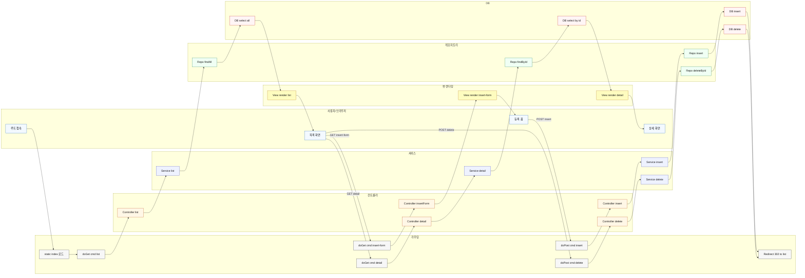

# 프로젝트 동작 플로우차트 (UX 개선 버전)

아래 다이어그램은 사용자 흐름과 서버 내부 흐름을 구분해 읽기 쉽게 구성한 `Mermaid` 플로우차트입니다.

```mermaid
flowchart LR
    %% Column layout with row-aligned nodes
    subgraph U[사용자/브라우저]
        direction TB
        U_root[루트 접속]
        U_list[목록 화면]
        U_detail[상세 화면]
        U_form[등록 폼]
    end

    subgraph R[라우팅]
        direction TB
        R_index[static index 로드]
        R_get_list[doGet cmd list]
        R_get_detail[doGet cmd detail]
        R_get_form[doGet cmd insert-form]
        R_post_insert[doPost cmd insert]
        R_post_delete[doPost cmd delete]
        R_redirect_list[Redirect 302 to list]
    end

    subgraph C[컨트롤러]
        direction TB
        C_list[Controller list]
        C_detail[Controller detail]
        C_form[Controller insertForm]
        C_insert[Controller insert]
        C_delete[Controller delete]
    end

    subgraph S[서비스]
        direction TB
        S_list[Service list]
        S_detail[Service detail]
        S_insert[Service insert]
        S_delete[Service delete]
    end

    subgraph P[레포지토리]
        direction TB
        P_list[Repo findAll]
        P_detail[Repo findById]
        P_insert[Repo insert]
        P_delete[Repo deleteById]
    end

    subgraph D[DB]
        direction TB
        D_list[DB select all]
        D_detail[DB select by id]
        D_insert[DB insert]
        D_delete[DB delete]
    end

    subgraph V[뷰 렌더링]
        direction TB
        V_list[View render list]
        V_detail[View render detail]
        V_form[View render insert-form]
    end

    %% Aligned flows
    U_root --> R_index --> R_get_list --> C_list --> S_list --> P_list --> D_list --> V_list --> U_list
    U_list -->|GET detail| R_get_detail --> C_detail --> S_detail --> P_detail --> D_detail --> V_detail --> U_detail
    U_list -->|GET insert-form| R_get_form --> C_form --> V_form --> U_form
    U_form -->|POST insert| R_post_insert --> C_insert --> S_insert --> P_insert --> D_insert --> R_redirect_list
    U_list -->|POST delete| R_post_delete --> C_delete --> S_delete --> P_delete --> D_delete --> R_redirect_list

    %% Styles
    classDef user fill:#f3f9ff,stroke:#2b6cb0,stroke-width:1px,color:#111
    classDef routing fill:#f7f7f7,stroke:#444,stroke-width:1px,color:#111
    classDef controller fill:#fff7e6,stroke:#c05621,stroke-width:1px,color:#111
    classDef service fill:#eef2ff,stroke:#4c51bf,stroke-width:1px,color:#111
    classDef repo fill:#f0fff4,stroke:#2f855a,stroke-width:1px,color:#111
    classDef db fill:#fff5f5,stroke:#c53030,stroke-width:1px,color:#111
    classDef view fill:#fefcbf,stroke:#b7791f,stroke-width:1px,color:#111

    class U_root,U_list,U_detail,U_form user
    class R_index,R_get_list,R_get_detail,R_get_form,R_post_insert,R_post_delete,R_redirect_list routing
    class C_list,C_detail,C_form,C_insert,C_delete controller
    class S_list,S_detail,S_insert,S_delete service
    class P_list,P_detail,P_insert,P_delete repo
    class D_list,D_detail,D_insert,D_delete db
    class V_list,V_detail,V_form view
```
